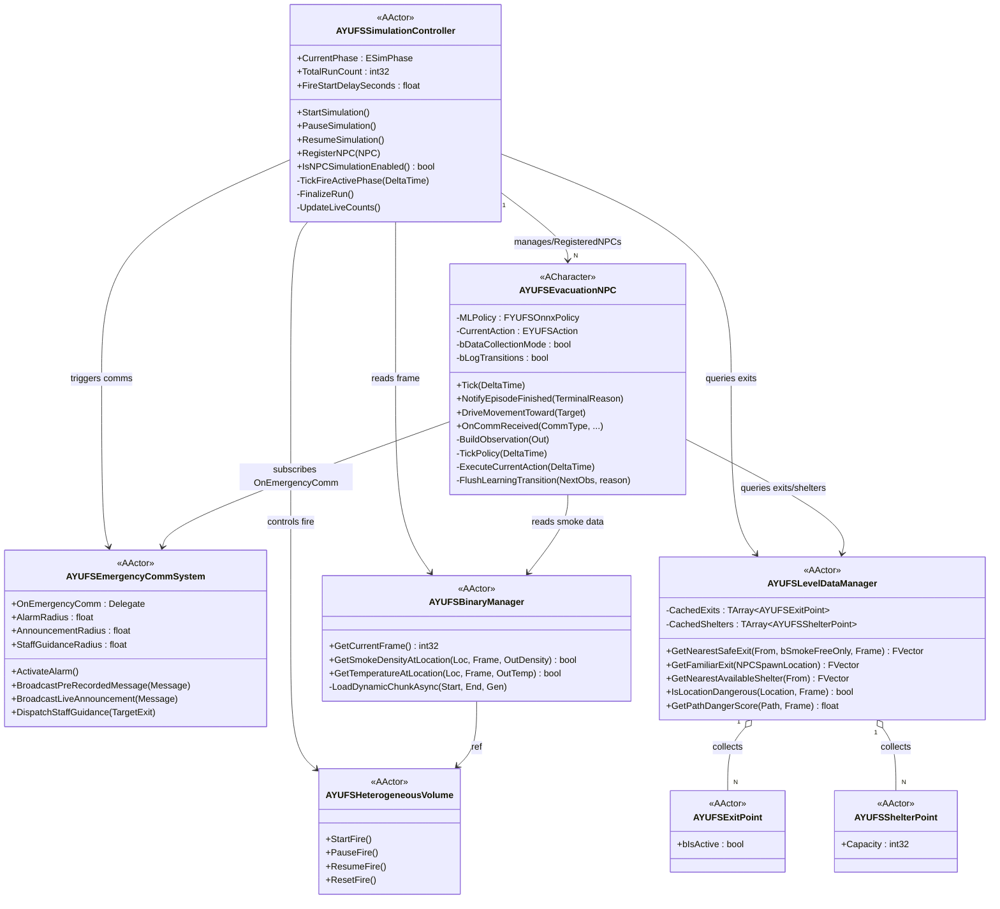
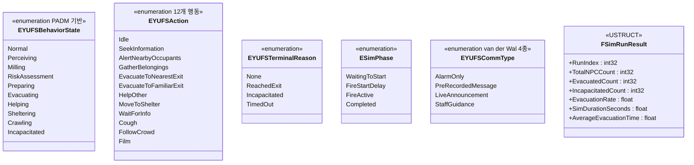
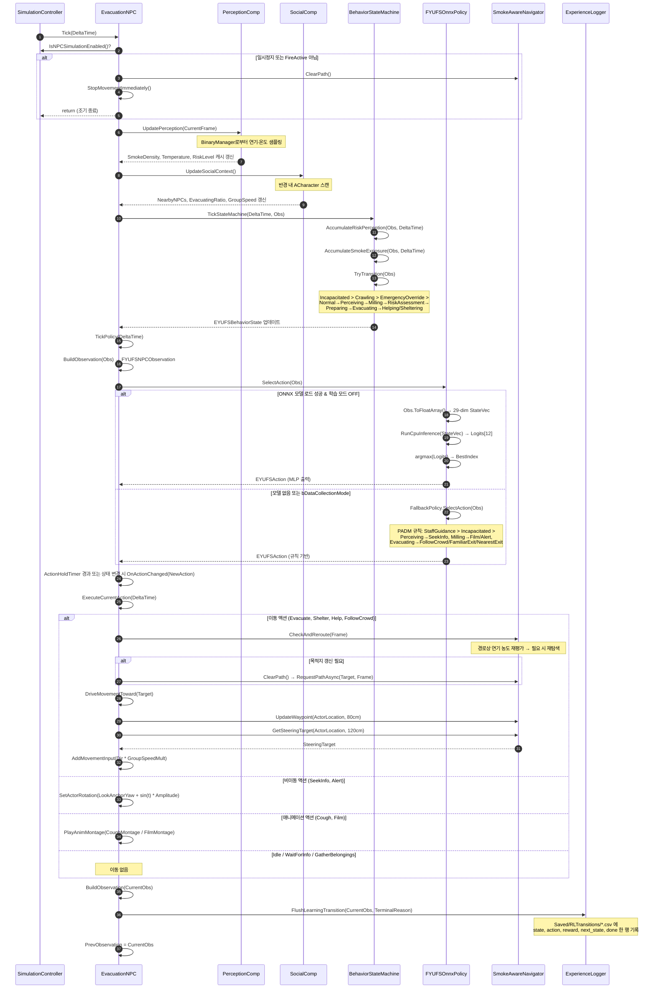
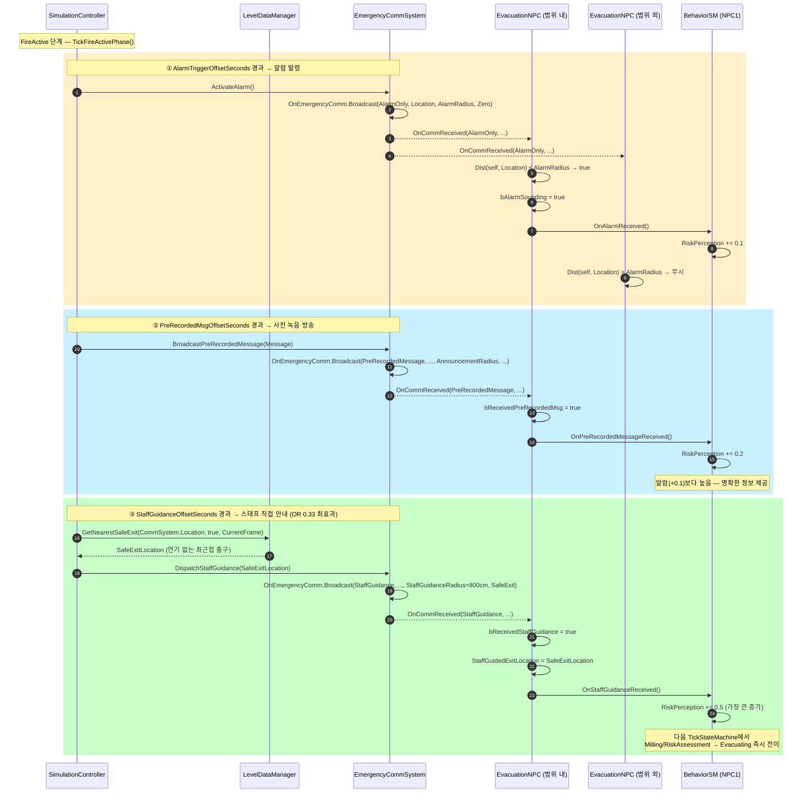
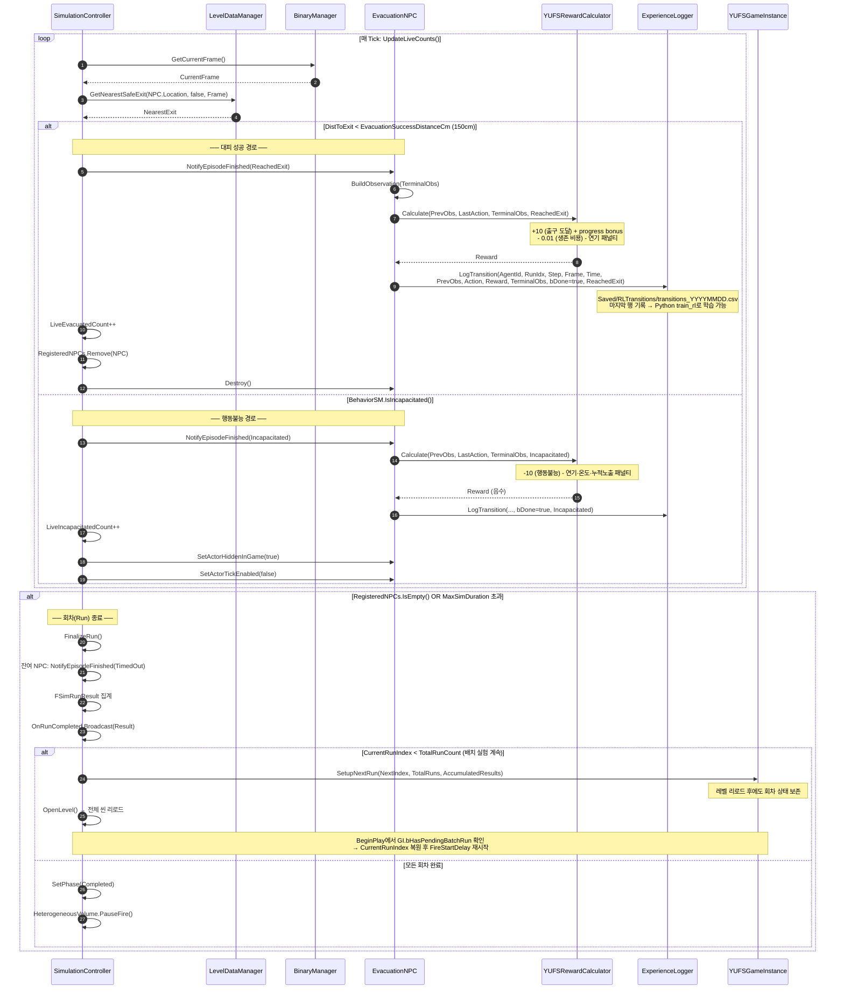
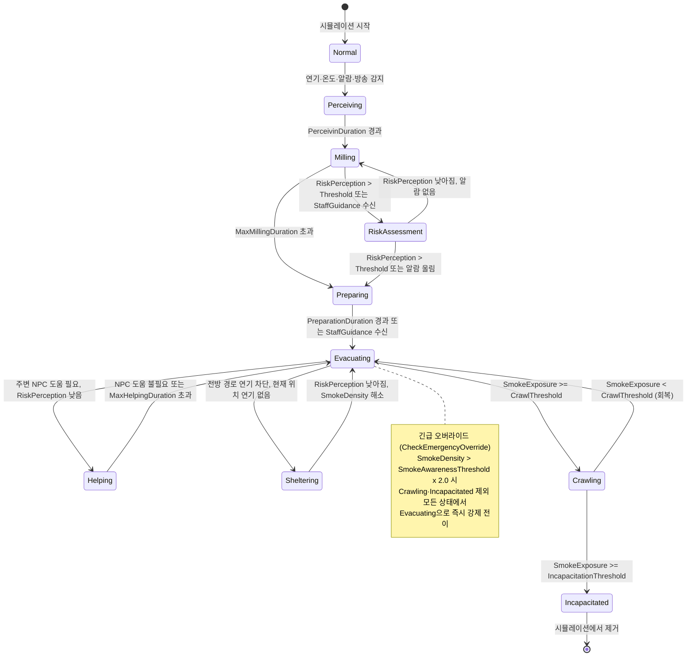

# YUFS 아키텍처 다이어그램

> UE 5.7 기반 화재 대피 시뮬레이션 — Kuligowski PADM 행동심리 모델 + MLP 정책 (ONNX)

---

## 1. 클래스 다이어그램 — 전체 시스템 개요

---

## 2. 클래스 다이어그램 — NPC 서브시스템 상세

```mermaid
classDiagram
    direction TB

    class AYUFSEvacuationNPC {
        <<ACharacter>>
        -PerceptionComp : UYUFSNPCPerceptionComponent
        -BehaviorSM : UYUFSBehaviorStateMachine
        -Navigator : UYUFSSmokeAwareNavigator
        -SocialComp : UYUFSSocialInfluenceComponent
        -DebugComp : UYUFSNPCDebugComponent
        -MLPolicy : FYUFSOnnxPolicy
        -CurrentAction : EYUFSAction
        -PolicyTickInterval : float = 0.1
        -MinActionHoldDuration : float = 2.0
        +Tick(DeltaTime)
        +NotifyEpisodeFinished(reason)
        +DriveMovementToward(Target)
        -BuildObservation(Out FYUFSNPCObservation)
        -TickPolicy(DeltaTime)
        -ExecuteCurrentAction(DeltaTime)
        -ResolveNavigationTarget(Action) FVector
        -FlushLearningTransition(NextObs, reason)
        -UpdateStuckDetection(DeltaTime)
    }

    class IYUFSDecisionPolicy {
        <<interface>>
        +SelectAction(Obs) EYUFSAction
        +OnTransition(PrevObs, Action, NextObs, Reward, bDone)
        +IsDataCollectionMode() bool
        +LoadModel(Path)
    }

    class FYUFSOnnxPolicy {
        -FallbackPolicy : FYUFSRuleBasedPolicy
        -ModelPath : FString
        -RuntimeName : FString
        -bDataCollectionMode : bool
        -bModelReady : bool
        -CpuModelInstance
        -GpuModelInstance
        -InputBuffer : TArray~float~
        -OutputBuffer : TArray~float~
        +SelectAction(Obs) EYUFSAction
        +SetDataCollectionMode(bEnable)
        -EnsureModelLoaded() bool
        -ConfigureCpuModelInstance() bool
        -ConfigureGpuModelInstance() bool
        -RunCpuInference(StateVec, OutLogits) bool
        -RunGpuInference(StateVec, OutLogits) bool
        -ParseInputShape(InputDescs, OutputDescs, OutShape) bool
        -FinalizeBuffers(OutputShapes, OutputDesc, InputShape) bool
        -PrepareInferenceBindings(StateVec, InBindings, OutBindings) bool
        -FindLatestOnnxModelPath() FString
        -SelectActionFromLogits(Logits) EYUFSAction
    }

    class FYUFSRuleBasedPolicy {
        +SelectAction(Obs) EYUFSAction
    }

    class FYUFSPolicyFactory {
        <<static utility>>
        +Create(EPolicyType, ModelPath, RuntimeName) TSharedPtr~IYUFSDecisionPolicy~
    }

    class UYUFSBehaviorStateMachine {
        <<UActorComponent>>
        +Config : UYUFSBehaviorConfig
        -CurrentState : EYUFSBehaviorState
        -RiskPerception : float
        -SmokeExposureAccumulated : float
        -StateTimer : float
        +TickStateMachine(DeltaTime, Obs)
        +GetCurrentState() EYUFSBehaviorState
        +GetRiskPerception() float
        +GetSmokeExposure() float
        +IsIncapacitated() bool
        +IsCrawling() bool
        +OnAlarmReceived()
        +OnPreRecordedMessageReceived()
        +OnLiveAnnouncementReceived()
        +OnStaffGuidanceReceived()
        -TryTransition(Obs)
        -AccumulateRiskPerception(Obs, DeltaTime)
        -AccumulateSmokeExposure(Obs, DeltaTime)
        -CheckEmergencyOverride(Obs) bool
    }

    class UYUFSNPCPerceptionComponent {
        <<UActorComponent>>
        +Config : UYUFSPerceptionConfig
        -BinaryManager : AYUFSBinaryManager
        -CachedSmokeDensity : float
        -CachedTemperature : float
        -CachedRiskLevel : float
        +UpdatePerception(Frame)
        +GetSmokeDensity() float
        +GetTemperature() float
        +GetSmokeInFrontNormalized() float
        +GetSmokeAboveNormalized() float
        +GetRiskLevel() float
    }

    class UYUFSSmokeAwareNavigator {
        <<UActorComponent>>
        +RerouteCheckInterval : float
        +SmokeBlockThreshold : float
        -CurrentPath : TArray~FVector~
        -CurrentDestination : FVector
        +RequestPathAsync(Dest, Frame)
        +OnPathFound(PathId, Result, NavPath)
        +GetSteeringTarget(ActorLocation, LookAhead) FVector
        +UpdateWaypoint(ActorLocation, Radius)
        +CheckAndReroute(Frame)
        +ClearPath()
        +GetCurrentDestination() FVector
    }

    class UYUFSSocialInfluenceComponent {
        <<UActorComponent>>
        +SocialInfluenceRadius : float
        +BystanderEffectStrength : float
        +SocialDelayPerMember : float
        -NearbyNPCs : TArray~ACharacter~
        +UpdateSocialContext()
        +GetNearbyEvacuatingRatio() float
        +GetNearbyNPCCount() int32
        +GetAverageEvacuationDestination() FVector
        +GetNearestNPCNeedingHelpLocation() FVector
        +ShouldHelpNearbyNPC() bool
        +GetGroupSpeedMultiplier() float
    }

    class FYUFSNPCObservation {
        <<USTRUCT 29-dim>>
        +SmokeDensityAtSelf : float
        +TemperatureAtSelf : float
        +SmokeInFrontNormalized : float
        +SmokeAboveNormalized : float
        +RiskLevel : float
        +SimTimeNormalized : float
        +DistToNearestExit : float
        +DistToFamiliarExit : float
        +DirToNearestExit : FVector
        +bNearestExitSmokeFree : bool
        +DistToNearestShelter : float
        +NearbyEvacuatingRatio : float
        +NearbyNPCCount : int32
        +bAlarmSounding : bool
        +bReceivedStaffGuidance : bool
        +CurrentState : EYUFSBehaviorState
        +RiskPerception : float
        +StressLevel : float
        +SmokeExposureAccumulated : float
        +ToFloatArray() TArray~float~
    }

    class YUFSRewardCalculator {
        <<static utility>>
        +Calculate(PrevObs, Action, NextObs, TerminalReason) float
    }

    class FYUFSExperienceLogger {
        <<static utility>>
        +LogTransition(AgentId, RunIndex, StepIndex, SimFrame, SimTime, State, Action, Reward, NextState, bDone, reason)
        +GetLogFilePath() FString
    }

    IYUFSDecisionPolicy <|.. FYUFSOnnxPolicy : implements
    IYUFSDecisionPolicy <|.. FYUFSRuleBasedPolicy : implements
    FYUFSOnnxPolicy *-- FYUFSRuleBasedPolicy : fallback
    FYUFSPolicyFactory ..> IYUFSDecisionPolicy : creates

    AYUFSEvacuationNPC *-- UYUFSBehaviorStateMachine : component
    AYUFSEvacuationNPC *-- UYUFSNPCPerceptionComponent : component
    AYUFSEvacuationNPC *-- UYUFSSmokeAwareNavigator : component
    AYUFSEvacuationNPC *-- UYUFSSocialInfluenceComponent : component
    AYUFSEvacuationNPC *-- FYUFSOnnxPolicy : policy (value)
    AYUFSEvacuationNPC ..> FYUFSNPCObservation : builds each tick
    AYUFSEvacuationNPC ..> YUFSRewardCalculator : calculates reward
    AYUFSEvacuationNPC ..> FYUFSExperienceLogger : writes transitions

    UYUFSBehaviorStateMachine ..> FYUFSNPCObservation : reads
    FYUFSOnnxPolicy ..> FYUFSNPCObservation : reads
```

---

## 3. 열거형 & 데이터 구조

---

## 4. 시퀀스 다이어그램 — NPC 매 Tick 사이클

---

## 5. 시퀀스 다이어그램 — 긴급 통신 이벤트 흐름

---

## 6. 시퀀스 다이어그램 — 에피소드 종료 & ML 데이터 로깅

---

## 7. PADM 행동 상태 전이 다이어그램

---

## 8. ML 학습 파이프라인 개요

```mermaid
flowchart LR
    subgraph UE5["UE5 시뮬레이션 런타임"]
        SIM["AYUFSSimulationController\n(다회차 배치 실험)"]
        NPC["AYUFSEvacuationNPC\n(bLogTransitions = true)"]
        LOG["FYUFSExperienceLogger"]
        CSV["Saved/RLTransitions/\ntransitions_YYYYMMDD.csv"]
    end

    subgraph PY["Python train_rl/"]
        DS["dataset.py\nCSV 파싱·정규화"]
        BC["bc_model.py\nMLP (29→128→128→12)\nBehavior Cloning"]
        RF["train_rf.py\nRandomForest (200 trees)"]
        ONNX_BC["export_onnx.py\nBC → ONNX\n(정규화 내장)"]
        ONNX_RF["export_onnx_rf.py\nRF → ONNX\n(class expand)"]
        MODEL["Saved/RLModels/\n*.onnx"]
    end

    subgraph INFER["UE5 추론 (FYUFSOnnxPolicy)"]
        NNE["NNERuntimeORTCpu\n또는 NNERuntimeORTDml"]
        POL["ONNX 추론\n→ Logits[12]\n→ argmax → EYUFSAction"]
    end

    SIM -->|배치 실험 회차 진행| NPC
    NPC -->|FlushLearningTransition| LOG
    LOG -->|기록| CSV
    CSV -->|로드| DS
    DS -->|TensorDataset| BC
    DS -->|numpy array| RF
    BC -->|학습 완료| ONNX_BC
    RF -->|학습 완료| ONNX_RF
    ONNX_BC -->|저장| MODEL
    ONNX_RF -->|저장| MODEL
    MODEL -->|자동 탐색 FindLatestOnnxModelPath| NNE
    NNE --> POL
    POL -->|EYUFSAction| NPC
```

